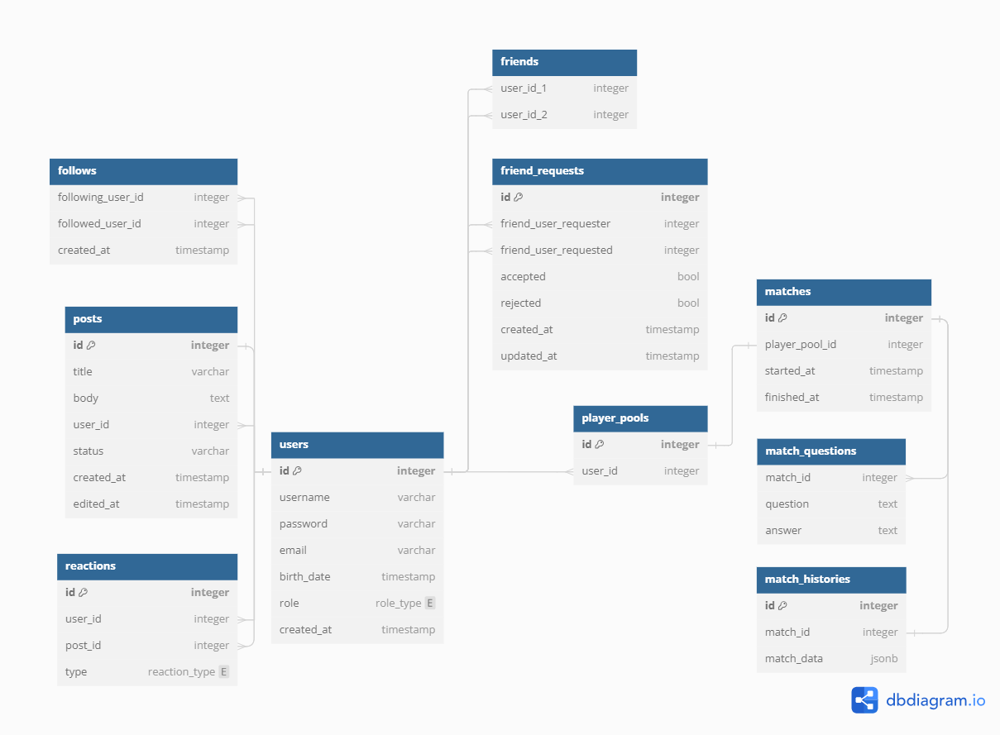

# GPT Trivia Metadata Database

This repo contains the Database change management for the GPT Trivia metadata DB.

## Tech stack

- [PostgreSQL](https://www.postgresql.org/)
- [Sqitch](https://sqitch.org/)

## Schema

1. Users
    - Friends
    - Friend Requests
    - Follows
        - Follows allow users to be notified users of activity of the users that are followed.
2. Posts
    - Reactions
        - User reaction to the post. (Like/Dislike the post. Custom reactions can be leveraged in the future)
3. Matches
    - Player Pools
        - Collection of users that are playing/have played a match.
    - Match Questions
        - Trivia questions asked during the match.
    - Match History
        - History stores the complete state of the game. Stored as a JSON object.

# TODO

- Create data model for the Match History JSON object.
- Create helper script/makefile for easy Sqitch deploy/verify/revert